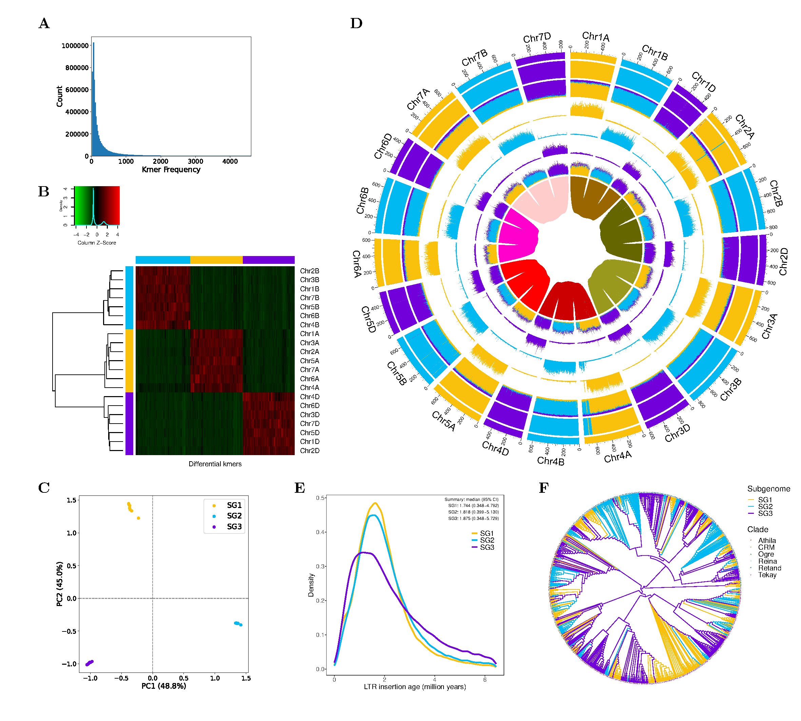

### Quick install and start ###
```
git clone https://github.com/zhangrengang/SubPhaser
cd SubPhaser

# install
conda env create -f SubPhaser.yaml
conda activate SubPhaser
python setup.py install

# start
cd example_data
# small genome (Arabidopsis_suecica: 270Mb)
bash test_Arabidopsis.sh
# middle genome    (peanut: 2.6Gb)
bash test_peanut.sh
# large genome (wheat: 14Gb)
bash test_wheat.sh
```
## Table of Contents

   * [Introduction](#introduction)
   * [Inputs](#Inputs)
   * [Run SubPhaser](#Run-SubPhaser)
   * [Outputs](#Outputs)
   * [Full Usage](#Usage)

### Introduction ###
For many allopolyploid species, their diploid progenitors are unknown or extinct, making it impossible to unravel the subgenome. 
Here, we develop `SubPhaser` to partition and phase subgenomes, by using repetitive kmers as "genomic signatures". 
We also identify genome-wide subgenome-specific regions and LTR-RTs, which will provide insight to the evolutionary history of allopolyploid.

There are mainly three modules:

1. The core module to partition and phase subgenomes
2. `LTR` module to identify and analysis subgenome-specific LTR-RT elements
3. `Visualization` module to visualize genome-wide data

The below is an example of output figures of wheat (ABD, 1n=3x=21):


**Figure. Phased subgenomes in allohexaploid bread wheat genome.**
(**A**) The histgram of differential 15-mers among homoeologous chromosome sets. 
(**B**) Clustering and (**C**) principal component analysis of differential 15-mers that differentiate homeologous chromosomes 
enables the consistent partitioning of the genome into three subgenomes. 
(**D**) Chromosomal characteristics. Rings from outer to inner: 
(**1**) Karyotypes based on k-Means algorithm. 
(**2**) Significant enrichment of subgenome-specific k-mers. 
The same color as the karyotype indicates significant enrichment in that karyotype. 
The white areas are not significantly enriched. 
(**3**) The normalized proportion of subgenome-specific k-mers. 
(**4-6**) Density distribution of each subgenome-specific k-mer set. 
(**7**) The density of subgenome-specific LTR-RTs. 
(**8**) homoeologous blocks. All statistics are computed for windows of 1 Mb. 
(**E**) Insertion time of subgenome-specific LTR-RTs. 
(**F**) A phylogenetic tree of 1,000 Gypsy LTR-RTs randomly selected from the subgenome-specific LTR-RTs.

### Inputs ###
1. Chromosome-level genome sequences (**fasta** format), e.g. [the wheat genome](https://wheat-urgi.versailles.inra.fr/Seq-Repository/Assemblies) (ABD, 1n=3x=21).
2. Configuration of homologous chromosome sets, e.g. 
```
Chr1A   Chr1B   Chr1D                      # each row is one homologous chromosome set
Chr2B   Chr2A   Chr2D                      # seperate with blank chracter(s)
Chr3D   Chr3B   Chr3A                      # chromosome order is arbitrary
Chr4A   Chr4B   Chr4D
5A|Chr5A   5B|Chr5B   5D|Chr5D             # will rename chromosome id as 5A, 5B and 5D
Chr6A,Chr7A   Chr6B,Chr7B   Chr6D,Chr7D    # treat multiple chromosomes together using ","
```
### Run SubPhaser ###
Run with default parameters:
```
subphaser -i genome.fasta.gz -c sg.config
```
Run with only core algorithm enabled:
```
subphaser -i genome.fasta.gz -c sg.config -disable_ltr -disable_circos
```
Change key parameters:
```
subphaser -i genome.fasta.gz -c sg.config -k 13 -q 100 -f 2
```
### Outputs ###
```
phase-results/
├── k15_q200_f2.circos/                # config and data files for circos plot, developer may re-plot with some custom modification
├── k15_q200_f2.kmer_freq.pdf          # histogram of differential kmers, useful to adjust option `-q`
├── k15_q200_f2.kmer.mat               # differential kmer matrix (m kmer x n chromosome)
├── k15_q200_f2.kmer.mat.pdf           # heatmap of the kmer matrix
├── k15_q200_f2.kmer.mat.R             # R script for the heatmap plot
├── k15_q200_f2.kmer_pca.pdf           # PCA plot of the kmer matrix
├── k15_q200_f2.chrom-subgenome.tsv    # subgenome assignments and bootstrap values
├── k15_q200_f2.sig.kmer-subgenome.tsv # subgenome-specific kmers
├── k15_q200_f2.bin.enrich             # subgenome-specific enrichments by genome window/bin
├── k15_q200_f2.ltr.enrich             # subgenome-specific LTR-RTs
├── k15_q200_f2.ltr.insert.pdf         # density plot of insertion age of subgenome-specific LTR-RTs
├── k15_q200_f2.ltr.insert.R           # R script for the density plot
├── k15_q200_f2.LTR_Copia.tree.pdf     # phylogenetic tree plot of subgenome-specific LTR/Copia elements
├── k15_q200_f2.LTR_Copia.tree.R       # R script for the LTR/Copia tree plot
├── k15_q200_f2.LTR_Gypsy.tree.pdf     # phylogenetic tree plot of subgenome-specific LTR/Gypsy elements
├── k15_q200_f2.LTR_Gypsy.tree.R       # R script for the LTR/Gypsy tree plot
├── k15_q200_f2.circos.pdf             # final circos plot
├── k15_q200_f2.circos.png
├── circos_legend.txt                  # legend of circos plot

tmp/
├── LTR.scn                 # identifation of LTR-RTs by LTRhavest and/or LTRfinder
├── LTR.inner.fa            # inner sequences of LTR-RTs
├── LTR.inner.fa.cls.*      # classfication of LTR-RTs by TEsorter
├── LTR.filtered.LTR.fa     # full sequences of filtered LTR-RTs
├── LTR.LTR_*.aln           # alignments of LTR-RTs' protein domains
├── LTR.LTR_*.rooted.tre    # phylogenetic tree files
├── LTR.LTR_*.map           # information of tip nodes on the tree
.....
```

### Usage ###
```
usage: subphaser [-h] -i GENOME [GENOME ...] -c CFGFILE [CFGFILE ...]
                         [-labels LABEL [LABEL ...]] [-no_label]
                         [-target FILE] [-sep STR] [-pre STR] [-o DIR]
                         [-tmpdir DIR] [-k INT] [-f FLOAT] [-q INT]
                         [-baseline BASELINE] [-lower_count INT]
                         [-min_prop FLOAT] [-max_freq INT] [-max_prop FLOAT]
                         [-low_mem] [-re_filter] [-nsg INT] [-replicates INT]
                         [-jackknife FLOAT] [-max_pval FLOAT]
                         [-figfmt {pdf,png}]
                         [-heatmap_colors COLOR [COLOR ...]]
                         [-heatmap_options STR] [-disable_ltr]
                         [-ltr_detectors {ltr_finder,ltr_harvest} [{ltr_finder,ltr_harvest} ...]]
                         [-ltr_finder_options STR] [-ltr_harvest_options STR]
                         [-tesorter_options STR] [-all_ltr] [-intact_ltr]
                         [-mu FLOAT] [-disable_ltrtree] [-subsample INT]
                         [-ltr_domains {GAG,PROT,INT,RT,RH,AP,RNaseH} [{GAG,PROT,INT,RT,RH,AP,RNaseH} ...]]
                         [-trimal_options STR] [-iqtree_options STR]
                         [-ggtree_options STR] [-disable_circos]
                         [-window_size INT] [-disable_blocks] [-aligner PROG]
                         [-aligner_options STR] [-min_block INT] [-p INT]
                         [-max_memory MEM] [-cleanup] [-overwrite]

optional arguments:
  -h, --help            show this help message and exit

Input:
  Input genome and config files

  -i GENOME [GENOME ...], -genomes GENOME [GENOME ...]
                        Input genome sequences in fasta format [required]
  -c CFGFILE [CFGFILE ...], -sg_cfgs CFGFILE [CFGFILE ...]
                        Subgenomes config file (one homologous group per
                        line); this chromosome set is for identifying
                        differential kmers [required]
  -labels LABEL [LABEL ...]
                        For multiple genomes, provide prefix labels for each
                        genome sequence to avoid conficts among chromosome id
                        [default: '1-, 2-, ..., n-']
  -no_label             Do not use default prefix labels for genome sequences
                        as there is no confict among chromosome id [default:
                        False]
  -target FILE          Target chromosomes to output; id mapping is allowed;
                        this chromosome set is for cluster and phase [default:
                        the same chromosome set as `-sg_cfgs`]
  -sep STR              Seperator for chromosome ID [default="|"]

Output:
  -pre STR, -prefix STR
                        Prefix for output [default=None]
  -o DIR, -outdir DIR   Output directory [default=phase-results]
  -tmpdir DIR           Temporary directory [default=tmp]

Kmer:
  Options to count and filter kmers

  -k INT                Length of kmer [default=15]
  -f FLOAT, -min_fold FLOAT
                        Minimum fold [default=2]
  -q INT, -min_freq INT
                        Minimum total count for each kmer; will not work if
                        `-min_prop` is specified [default=200]
  -baseline BASELINE    Use sub-maximum (1) or minimum (-1) as the baseline of
                        fold [default=1]
  -lower_count INT      Don't output k-mer with count < lower-count
                        [default=3]
  -min_prop FLOAT       Minimum total proportion (< 1) for each kmer
                        [default=None]
  -max_freq INT         Maximum total count for each kmer; will not work if
                        `-max_prop` is specified [default=1000000000.0]
  -max_prop FLOAT       Maximum total proportion (< 1) for each kmer
                        [default=None]
  -low_mem              Low MEMory but slower [default: True if genome size >
                        3G, else False]
  -re_filter            Re-filter with subset of chromosomes (subgenome
                        assignments are expected to change) [default=False]

Cluster:
  Options for cluster to phase

  -nsg INT              Number of subgenomes (>1) [default: auto]
  -replicates INT       Number of replicates for bootstrap [default=1000]
  -jackknife FLOAT      Percent of kmers to resample for bootstrap
                        [default=50]
  -max_pval FLOAT       Maximum P value for hypothesis test [default=0.05]
  -figfmt {pdf,png}     Format of figures [default=pdf]
  -heatmap_colors COLOR [COLOR ...]
                        Color panel (2 or 3 colors) for heatmap plot
                        [default=('green', 'black', 'red')]
  -heatmap_options STR  Options for heatmap plot (see more in R shell with
                        `?heatmap.2` of `gplots` package) [default="Rowv=T,Col
                        v=T,scale='col',dendrogram='row',labCol=F,trace='none'
                        ,key=T,key.title=NA,density.info='density',main=NA,xla
                        b=NA,margins=c(4,8)"]

LTR:
  Options for LTR analyses

  -disable_ltr          Disable this step (this step is time-consuming for
                        large genome) [default=False]
  -ltr_detectors {ltr_finder,ltr_harvest} [{ltr_finder,ltr_harvest} ...]
                        Programs to detect LTR-RTs [default=['ltr_harvest',
                        'ltr_finder']]
  -ltr_finder_options STR
                        Options for `ltr_finder` to identify LTR-RTs (see more
                        with `ltr_finder -h`) [default="-w 2 -D 15000 -d 1000
                        -L 7000 -l 100 -p 20 -C -M 0.8"]
  -ltr_harvest_options STR
                        Options for `gt ltrharvest` to identify LTR-RTs (see
                        more with `gt ltrharvest -help`) [default="-similar 80
                        -vic 10 -seed 20 -seqids yes -minlenltr 100 -maxlenltr
                        7000 -mintsd 4 -maxtsd 6"]
  -tesorter_options STR
                        Options for `TEsorter` to classify LTR-RTs (see more
                        with `TEsorter -h`) [default="-db rexdb-plant -dp2"]
  -all_ltr              Use all LTR identified by `-ltr_detectors` (more LTRs
                        but slower) [default: only use LTR as classified by
                        `TEsorter`]
  -intact_ltr           Use completed LTR as classified by `TEsorter` (less
                        LTRs but faster) [default: the same as `-all_ltr`]
  -mu FLOAT             Substitution rate per year in the intergenic region,
                        for estimating age of LTR insertion [default=1.3e-08]
  -disable_ltrtree      Disable subgenome-specific LTR tree (this step is
                        time-consuming when subgenome-specific LTRs are too
                        much) [default=False]
  -subsample INT        Subsample LTRs to avoid too many to construct a tree
                        [default=1000] (0 to disable)
  -ltr_domains {GAG,PROT,INT,RT,RH,AP,RNaseH} [{GAG,PROT,INT,RT,RH,AP,RNaseH} ...]
                        Domains for LTR tree (Note: for domains identified by
                        `TEsorter`, PROT (rexdb) = AP (gydb), RH (rexdb) =
                        RNaseH (gydb)) [default=['INT', 'RT', 'RH']]
  -trimal_options STR   Options for `trimal` to trim alignment (see more with
                        `trimal -h`) [default="-automated1"]
  -iqtree_options STR   Options for `iqtree` to construct phylogenetic trees
                        (see more with `iqtree -h`) [default="-mset JTT"]
  -ggtree_options STR   Options for `ggtree` to show phylogenetic trees (see
                        more from `https://yulab-smu.top/treedata-book`)
                        [default="branch.length='none', layout='circular'"]

Circos:
  Options for circos plot

  -disable_circos       Disable this step [default=False]
  -window_size INT      Window size for circos plot [default=1000000]
  -disable_blocks       Disable to plot homologous blocks [default=False]
  -aligner PROG         Programs to identify homologous blocks
                        [default=minimap2]
  -aligner_options STR  Options for `-aligner` to align chromosome sequences
                        [default="-x asm20 -n 10"]
  -min_block INT        Minimum block size to show [default=100000]

Other options:
  -p INT, -ncpu INT     Maximum number of processors to use [default=32]
  -max_memory MEM       Maximum memory to use where limiting can be enabled.
                        [default=65.4G]
  -cleanup              Remove the temporary directory [default=False]
  -overwrite            Overwrite even if check point files existed
                        [default=False]
```
