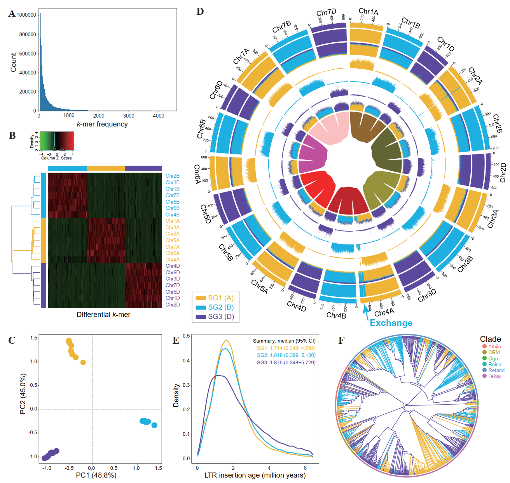

### Quick install and start ###
```
git clone https://github.com/zhangrengang/SubPhaser
cd SubPhaser

# install
conda env create -f SubPhaser.yaml
conda activate SubPhaser
python setup.py install

# start
cd example_data
# small genome    (Arabidopsis_suecica: 270Mb)
bash test_Arabidopsis.sh
# middle genome   (peanut: 2.6Gb)
bash test_peanut.sh
# large genome    (wheat: 14Gb)
bash test_wheat.sh
```
## Table of Contents

   * [Introduction](#introduction)
   * [Inputs](#Inputs)
   * [Run SubPhaser](#Run-SubPhaser)
   * [Run SubPhaser through Singularity/Apptainer](#Run-SubPhaser-through-SingularityApptainer)
   * [Outputs](#Outputs)
   * [When SubPhaser do not work](#When-SubPhaser-do-not-work)
   * [Citation](#Citation)
   * [Applications](#Applications)
   * [Contact](#Contact)
   * [Full Usage and Default Parameters](#Full-Usage-and-Default-Parameters)

### Introduction ###
For many allopolyploid species, their diploid progenitors are unknown or extinct, making it impossible to unravel their subgenomes. 
Here, we develop `SubPhaser` to phase subgenomes, by using repetitive kmers as the "differential signatures", assuming that repetitive sequences (mainly transposable elements) were expanded across chromosomes in the progenitors' independently evolving period. The tool also identifies genome-wide subgenome-specific regions and long terminal repeat retrotransposons (LTR-RTs), which will provide insights into the evolutionary history of allopolyploidization.

For details of methods and benchmarking results of SubPhaser, please see [the paper in *New Phytologist*](https://doi.org/10.1111/nph.18173) and 
its [Supplementary Material](https://nph.onlinelibrary.wiley.com/action/downloadSupplement?doi=10.1111%2Fnph.18173&file=nph18173-sup-0001-SupInfo.pdf) 
including performances in dozens of chromosome-level neoallopolyploid/hybrid genomes published before October, 2021.

There are mainly four modules:

1. The core module to phase subgenomes:
   - Count kmers by `jellyfish`.
   - Identify the differential kmers among homoeologous chromosome sets.
   - Cluster into subgenomes by a K-Means algorithm and estimate confidence level by the bootstrap.
   - Evaluate whether subgenomes are successfully phased by hierarchical clustering and principal component analysis (PCA).
2. The module to identify and test the enrichments of subgenome-specific kmers:
   - Identify subgenome-specific kmers.
   - Identify significant enrichments of subgenome-specific kmers by genome window/bin, which is useful to identify intewr-subgenomic exchanges (refer to [Supplementary Material](https://nph.onlinelibrary.wiley.com/action/downloadSupplement?doi=10.1111%2Fnph.18173&file=nph18173-sup-0001-SupInfo.pdf) for identifying bona fide exchanges) and/or assembly errors (e.g. switch errors and hamming errors).
   - Identify subgenome-specific enrichments with user-defined features (e.g. transposable elements, genes) via `-custom_features`.
3. The LTR module to identify and analyze subgenome-specific LTR-RT elements (disable by `-disable_ltr`):
   - Identify the LTR-RTs by `LTRharvest` and/or `LTRfinder` (time-consuming for large genome, especially `LTRfinder`).
   - Classify the LTR-RTs by `TEsorter`.
   - Identify subgenome-specific LTR-RTs by testing the enrichment of subgenome-specific kmers.
   - Estimate the insertion age of subgenome-specific LTR-RTs, which is helpful to estimate the time of divergence–hybridization period(s) 
(the period in which the progenitors are evolving independently; refer to [Supplementary Material](https://nph.onlinelibrary.wiley.com/action/downloadSupplement?doi=10.1111%2Fnph.18173&file=nph18173-sup-0001-SupInfo.pdf) for estimating the time period).
   - Reconstruct phylogenetic trees of subgenome-specific LTR/Gypsy and LTR/Copia elements, which is helpful to infer the evolutionary history of these LTR-RTs (disable by `-disable_ltrtree`, time-consuming for large genome).
4. The visualization module to visualize genome-wide data (disable by `-disable_circos`):
   - Identify the homoeologous blocks by `minimap2` simply (disable by `-disable_blocks`, time-consuming for large genome).
   - Integrate and visualize the whole genome-wide data by `circos`.

The below is an example of output figures of wheat (ABD, 1n=3x=21):


**Figure. Phased subgenomes of allohexaploid bread wheat genome.** Colors are unified with each subgenome in subplots `B-F`, i.e. the same color means the same subgenome.
* (**A**) The histogram of differential k-mers among homoeologous chromosome sets. 
* (**B**) Heatmap and clustering of differential k-mers. The x-axis, differential k-mers; y-axis, chromosomes. The vertical color bar, each chromosome is assigned to which subgenome; the horizontal color bar, each k-mer is specific to which subgenome (blank for non-specific kmers).
* (**C**) Principal component analysis (PCA) of differential k-mers. Points indicate chromosomes.
* (**D**) Chromosomal characteristics (window size: 1 Mb). Rings from outer to inner: 
   - (**1**) Subgenome assignments by a k-Means algorithm. 
   - (**2**) Significant enrichment of subgenome-specific k-mers (blank for non-enriched windows). 
   - (**3**) Normalized proportion of subgenome-specific k-mers. 
   - (**4-6**) Density distribution (count) of each subgenome-specific k-mer set. 
   - (**7**) Density distribution (count) of subgenome-specific LTR-RTs and other LTR-RTs (the most outer, in grey color). 
   - (**8**) Homoeologous blocks of each homoeologous chromosome set.
* (**E**) Insertion time of subgenome-specific LTR-RTs. 
* (**F**) A phylogenetic tree of 1,000 randomly subsampled LTR/Gypsy elements.

**Note**: On the clustering heatmap (Fig. B) and PCA plot (Fig. C), a subgenome is defined as well-phased if it has clearly distinguishable patterns of both differential k-mers and homeologous chromosomes, indicating that each subgenome shares subgenome-specific features as expected. If the subgenomes are not well-phased, the downstream analyses (may be failed) are meaningless and should be ignored. 
Sometimes, just a few abmormal chromosomes are mistakely assigned by the k-Means method, according to the heatmap, PCA and/or circos plots. 
In this case, the users could manually adjust the subgenome assignments (edit and rename the `*chrom-subgenome.tsv` file) and then feed it to SubPhaser by `-sg_assigned` option for downstream analysis.

### Inputs ###
1. Chromosome-level genome sequences (**fasta** format), e.g. [the wheat genome](https://wheat-urgi.versailles.inra.fr/Seq-Repository/Assemblies) (haploid assembly, ABD, 1n=3x=21).
**Note**: do not use hard-masked genome by RepeatMakser, as `subphaser` depends on repeat sequences.
2. Configuration of homoeologous chromosome sets, e.g. 
```
Chr1A   Chr1B   Chr1D                      # each row is one homoeologous chromosome set
Chr2B   Chr2A   Chr2D                      # chromosome order is arbitrary and useless
Chr3D   Chr3B   Chr3A                      # seperate with blank character(s)
Chr4B   Chr4D   Chr4A
5A|Chr5A   5B|Chr5B   5D|Chr5D             # will rename chromosome id to 5A, 5B and 5D, respectively
Chr6A,Chr7A   Chr6B,Chr7B   Chr6D,Chr7D    # will treat multiple chromosomes together using ","
```
If some homoeologous relationships are ambiguous, they can be placed as singletons that will not be used to identify differential kmers. For example:
```
Chr1A   Chr1B   Chr1D
Chr2B   Chr2A   Chr2D
Chr3D   Chr3B   Chr3A
Chr4B   Chr4D
Chr4A					# singleton(s) will skip the step to identify differential kmers
...
```
3. [Optional] Sequences of genomic features (**fasta** format, with `-custom_features`): Any sequences of genomic features, such as transposable elements (TEs), long terminal repeat retrotransposons (LTR-RTs), simple repeats and genes, could be fed to identify the subgenome-specific ones.

### Run SubPhaser ###
Run with default parameters:
```
subphaser -i genome.fasta.gz -c sg.config
```
Run with just the core algorithm enabled:
```
subphaser -i genome.fasta.gz -c sg.config -just_core
```
or
```
subphaser -i genome.fasta.gz -c sg.config -disable_ltr -disable_circos
```
Change key parameters when differential kmers are too few (see Fig. A):
```
subphaser -i genome.fasta.gz -c sg.config -k 15 -q 50 -f 2
```
Mutiple genomes (e.g. two relative species):
```
subphaser -i genomeA.fasta.gz genomeB.fasta.gz -c sg.config
```
Mutiple config files:
```
subphaser -i genome.fasta.gz -c sg1.config sg2.config
```
Input custom feature (e.g. transposable element, gene) sequences for subgenome-specific enrichments:
```
subphaser -i genome.fasta.gz -c sg.config -custom_features TEs.fasta genes.fasta
```
### Run SubPhaser through Singularity/Apptainer ###
Alternatively, you can run `subphaser` through Singularity/Apptainer container:
```
# install
apptainer remote add --no-login SylabsCloud cloud.sylabs.io
apptainer remote use SylabsCloud
apptainer pull subphaser.sif library://shang-hongyun/collection/subphaser.sif:1.2.6

# run
./subphaser.sif subphaser -h
```
### Outputs ###
```
phase-results/
├── k15_q200_f2.circos/                # config and data files for circos plot, so developers are able to re-plot with some custom modifications
├── k15_q200_f2.kmer_freq.pdf          # histogram of differential kmers, useful to adjust option `-q`
├── k15_q200_f2.kmer.mat               # differential kmer matrix (m kmer × n chromosome)
├── k15_q200_f2.kmer.mat.pdf           # heatmap of the kmer matrix
├── k15_q200_f2.kmer.mat.R             # R script for the heatmap plot
├── k15_q200_f2.kmer_pca.pdf           # PCA plot of the kmer matrix
├── k15_q200_f2.chrom-subgenome.tsv    # subgenome assignments and bootstrap values
├── k15_q200_f2.sig.kmer-subgenome.tsv # subgenome-specific kmers
├── k15_q200_f2.bin.enrich             # subgenome-specific enrichments by genome window/bin
├── k15_q200_f2.bin.group              # grouped bins by potential exchanges based on enrichments
├── k15_q200_f2.ltr.enrich             # subgenome-specific LTR-RTs
├── k15_q200_f2.ltr.insert.pdf         # density plot of insertion age of subgenome-specific LTR-RTs
├── k15_q200_f2.ltr.insert.R           # R script for the density plot
├── k15_q200_f2.LTR_Copia.tree.pdf     # phylogenetic tree plot of subgenome-specific LTR/Copia elements
├── k15_q200_f2.LTR_Copia.tree.R       # R script for the LTR/Copia tree plot
├── k15_q200_f2.LTR_Gypsy.tree.pdf     # phylogenetic tree plot of subgenome-specific LTR/Gypsy elements
├── k15_q200_f2.LTR_Gypsy.tree.R       # R script for the LTR/Gypsy tree plot
├── k15_q200_f2.circos.pdf             # final circos plot
├── k15_q200_f2.circos.png
├── circos_legend.txt                  # legend of the circos plot
.....

tmp/
├── LTR.scn                 # identification of LTR-RTs by LTRharvest and/or LTRfinder
├── LTR.inner.fa            # inner sequences of LTR-RTs
├── LTR.inner.fa.cls.*      # classfication of LTR-RTs by TEsorter
├── LTR.filtered.LTR.fa     # full sequences of the filtered LTR-RTs
├── LTR.LTR_*.aln           # alignments of LTR-RTs' protein domains for the below tree
├── LTR.LTR_*.rooted.tre    # phylogenetic tree files
├── LTR.LTR_*.map           # information of tip nodes on the above tree
.....
```

### When SubPhaser do not work ###
1. It is expected not to work with autopolyploids, as autopolyploids is expected not to produce subgenome-specific TEs.
2. It may not work when there are too many natural recombinations or artifact switch errors between subgenomes.
3. It does not work when there are no or too few TEs expanding in the independently evolving period of the progenitors or these TEs have been eliminated. This maybe true for some plants and fungi with low TE content.
4. It may not work for mesopolyploids, and not work for paleopolyploids, of which subgenome-specific TEs have been eliminated. However, the genetic boundary is not very clear.
5. Other unknown cases can be reported to me.

### Citation ###
If you use `SubPhaser`, please cite:
> Jia KH, Wang ZX, Wang L et. al. SubPhaser: A robust allopolyploid subgenome phasing method based on subgenome-specific k-mers [J]. *New Phytologist*, 2022, 235: 801-809 [DOI:10.1111/nph.18173](https://doi.org/10.1111/nph.18173)

### Applications ###
#### Evolution of genome size ####
In this study, `SubPhaser` was used to identify species-specific TEs among the apple tribe. By comparing the contents of non-TEs, species-specific TEs and non-specific TEs, the differences in genome size could be attributed to differential expansion and contraction of specific and non‐specific TEs, assuming that specific TEs expanded and non‐specific TEs contracted after split of species.
> Zhang TC, Qiao Q, Du X et. al. Cultivated hawthorn (*Crataegus pinnatifida* var. *major*) genome sheds light on the evolution of Maleae (apple tribe) [J]. *J. Integr. Plant Biol.*, 2022, 64 (8): 1487–1501 [DOI:10.1111/jipb.13318](http://doi.org/https://doi.org/10.1111/jipb.13318)
#### Evolution of reticulate allopolyploidization ####
In this study, `SubPhaser` was used to partition subgenomes of both neo-allotetraploid and neo-allooctoploid poppy genomes, 
identify exchanges between subgenomes and identify subgenome-specific LTR-RTs. 
By analysing subgenome phylogeny, exchange patterns and LTR-RT insertion time, a reticulate allopolyploidization evolutionary scenario was strongly supported.
> Zhang RG, Lu C, Li G et. al. Subgenome-aware analyses suggest a reticulate allopolyploidization origin in three *Papaver* genomes [J]. *Nat. Commun.*, 2023, 14 (1): 2204 [DOI:10.1038/s41467-023-37939-2](http://doi.org/10.1038/s41467-023-37939-2)

### Contact ###
For cooperations on polyploid genome research, please contact us via Email (zhangrengang@mail.kib.ac.cn) or WeChat (bio_ture).

### Full Usage and Default Parameters ###
```
usage: subphaser [-h] -i GENOME [GENOME ...] -c CFGFILE [CFGFILE ...]
                         [-labels LABEL [LABEL ...]] [-no_label]
                         [-target FILE] [-sg_assigned FILE] [-sep STR]
                         [-custom_features FASTA [FASTA ...]] [-pre STR]
                         [-o DIR] [-tmpdir DIR] [-k INT] [-f FLOAT] [-q INT]
                         [-baseline BASELINE] [-lower_count INT]
                         [-min_prop FLOAT] [-max_freq INT] [-max_prop FLOAT]
                         [-low_mem] [-by_count] [-re_filter] [-nsg INT]
                         [-replicates INT] [-jackknife FLOAT]
                         [-max_pval FLOAT]
                         [-test_method {ttest_ind,kruskal,wilcoxon,mannwhitneyu}]
                         [-figfmt {pdf,png}]
                         [-heatmap_colors COLOR [COLOR ...]]
                         [-heatmap_options STR] [-just_core] [-disable_ltr]
                         [-ltr_detectors {ltr_finder,ltr_harvest} [{ltr_finder,ltr_harvest} ...]]
                         [-ltr_finder_options STR] [-ltr_harvest_options STR]
                         [-tesorter_options STR] [-all_ltr] [-intact_ltr]
                         [-exclude_exchanges] [-shared_ltr] [-mu FLOAT]
                         [-disable_ltrtree] [-subsample INT]
                         [-ltr_domains {GAG,PROT,INT,RT,RH,AP,RNaseH} [{GAG,PROT,INT,RT,RH,AP,RNaseH} ...]]
                         [-trimal_options STR]
                         [-tree_method {iqtree,FastTree}] [-tree_options STR]
                         [-ggtree_options STR] [-disable_circos]
                         [-window_size INT] [-disable_blocks] [-aligner PROG]
                         [-aligner_options STR] [-min_block INT]
                         [-alt_cfgs CFGFILE [CFGFILE ...]] [-chr_ordered FILE]
                         [-p INT] [-max_memory MEM] [-cleanup] [-overwrite]
                         [-v]

Phase and visualize subgenomes of an allopolyploid or hybrid based on the repetitive kmers.

optional arguments:
  -h, --help            show this help message and exit

Input:
  Input genome and config files

  -i GENOME [GENOME ...], -genomes GENOME [GENOME ...]
                        Input genome sequences in fasta format [required]
  -c CFGFILE [CFGFILE ...], -sg_cfgs CFGFILE [CFGFILE ...]
                        Subgenomes config file (one homologous group per
                        line); this chromosome set is for identifying
                        differential kmers [required]
  -labels LABEL [LABEL ...]
                        For multiple genomes, provide prefix labels for each
                        genome sequence to avoid conficts among chromosome id
                        [default: '1-, 2-, ..., n-']
  -no_label             Do not use default prefix labels for genome sequences
                        as there is no confict among chromosome id
                        [default=False]
  -target FILE          Target chromosomes to output; id mapping is allowed;
                        this chromosome set is for cluster and phase [default:
                        the same chromosome set as `-sg_cfgs`]
  -sg_assigned FILE     Provide subgenome assignments to skip k-means
                        clustering and to identify subgenome-specific features
                        [default=None]
  -sep STR              Seperator for chromosome ID [default="|"]
  -custom_features FASTA [FASTA ...]
                        Custom features in fasta format to enrich subgenome-
                        specific kmers, such as TE and gene [default: None]

Output:
  -pre STR, -prefix STR
                        Prefix for output [default=None]
  -o DIR, -outdir DIR   Output directory [default=phase-results]
  -tmpdir DIR           Temporary directory [default=tmp]

Kmer:
  Options to count and filter kmers

  -k INT                Length of kmer [default=15]
  -f FLOAT, -min_fold FLOAT
                        Minimum fold [default=2]
  -q INT, -min_freq INT
                        Minimum total count for each kmer; will not work if
                        `-min_prop` is specified [default=200]
  -baseline BASELINE    Use sub-maximum (1) or minimum (-1) as the baseline of
                        fold [default=1]
  -lower_count INT      Don't output k-mer with count < lower-count
                        [default=3]
  -min_prop FLOAT       Minimum total proportion (< 1) for each kmer
                        [default=None]
  -max_freq INT         Maximum total count for each kmer; will not work if
                        `-max_prop` is specified [default=1000000000.0]
  -max_prop FLOAT       Maximum total proportion (< 1) for each kmer
                        [default=None]
  -low_mem              Low MEMory but slower [default: True if genome size >
                        3G, else False]
  -by_count             Calculate fold by count instead of by proportion
                        [default=False]
  -re_filter            Re-filter with subset of chromosomes (subgenome
                        assignments are expected to change) [default=False]

Cluster:
  Options for clustering to phase

  -nsg INT              Number of subgenomes (>1) [default: auto]
  -replicates INT       Number of replicates for bootstrap [default=1000]
  -jackknife FLOAT      Percent of kmers to resample for each bootstrap
                        [default=50]
  -max_pval FLOAT       Maximum P value for all hypothesis tests
                        [default=0.05]
  -test_method {ttest_ind,kruskal,wilcoxon,mannwhitneyu}
                        The test method to identify differiential
                        kmers[default=ttest_ind]
  -figfmt {pdf,png}     Format of figures [default=pdf]
  -heatmap_colors COLOR [COLOR ...]
                        Color panel (2 or 3 colors) for heatmap plot [default:
                        ('green', 'black', 'red')]
  -heatmap_options STR  Options for heatmap plot (see more in R shell with
                        `?heatmap.2` of `gplots` package) [default="Rowv=T,Col
                        v=T,scale='col',dendrogram='row',labCol=F,trace='none'
                        ,key=T,key.title=NA,density.info='density',main=NA,xla
                        b='Differential kmers',margins=c(2.5,12)"]
  -just_core            Exit after the core phasing module
                        [default=False]

LTR:
  Options for LTR analyses

  -disable_ltr          Disable this step (this step is time-consuming for
                        large genome) [default=False]
  -ltr_detectors {ltr_finder,ltr_harvest} [{ltr_finder,ltr_harvest} ...]
                        Programs to detect LTR-RTs [default=['ltr_harvest']]
  -ltr_finder_options STR
                        Options for `ltr_finder` to identify LTR-RTs (see more
                        with `ltr_finder -h`) [default="-w 2 -D 15000 -d 1000
                        -L 7000 -l 100 -p 20 -C -M 0.8"]
  -ltr_harvest_options STR
                        Options for `gt ltrharvest` to identify LTR-RTs (see
                        more with `gt ltrharvest -help`) [default="-seqids yes
                        -similar 80 -vic 10 -seed 20 -minlenltr 100 -maxlenltr
                        7000 -mintsd 4 -maxtsd 6"]
  -tesorter_options STR
                        Options for `TEsorter` to classify LTR-RTs (see more
                        with `TEsorter -h`) [default="-db rexdb -dp2"]
  -all_ltr              Use all LTR-RTs identified by `-ltr_detectors` (more
                        LTR-RTs but slower) [default: only use LTR as
                        classified by `TEsorter`]
  -intact_ltr           Use completed LTR-RTs classified by `TEsorter` (less
                        LTR-RTs but faster) [default: the same as `-all_ltr`]
  -exclude_exchanges    Exclude potential exchanged LTRs for insertion age
                        estimation and phylogenetic trees [default=False]
  -shared_ltr           Identify shared LTR-RTs among subgenomes
                        (experimental) [default=False]
  -mu FLOAT             Substitution rate per year in the intergenic region,
                        for estimating age of LTR insertion [default=1.3e-08]
  -disable_ltrtree      Disable subgenome-specific LTR tree (this step is
                        time-consuming when subgenome-specific LTR-RTs are too
                        many, so `-subsample` is enabled by defualt)
                        [default=False]
  -subsample INT        Subsample LTR-RTs to avoid too many to construct a
                        tree [default=1000] (0 to disable)
  -ltr_domains {GAG,PROT,INT,RT,RH,AP,RNaseH} [{GAG,PROT,INT,RT,RH,AP,RNaseH} ...]
                        Domains for LTR tree (Note: for domains identified by
                        `TEsorter`, PROT (rexdb) = AP (gydb), RH (rexdb) =
                        RNaseH (gydb)) [default: ['INT', 'RT', 'RH']]
  -trimal_options STR   Options for `trimal` to trim alignment (see more with
                        `trimal -h`) [default="-automated1"]
  -tree_method {iqtree,FastTree}
                        Programs to construct phylogenetic trees
                        [default=FastTree]
  -tree_options STR     Options for `-tree_method` to construct phylogenetic
                        trees (see more with `iqtree -h` or `FastTree
                        -expert`) [default=""]
  -ggtree_options STR   Options for `ggtree` to show phylogenetic trees (see
                        more from `https://yulab-smu.top/treedata-book`)
                        [default="branch.length='none', layout='circular'"]

Circos:
  Options for circos plot

  -disable_circos       Disable this step [default=False]
  -window_size INT      Window size (bp) for circos plot [default=1000000]
  -disable_blocks       Disable to plot homologous blocks [default=False]
  -aligner PROG         Programs to identify homologous blocks
                        [default=minimap2]
  -aligner_options STR  Options for `-aligner` to align chromosome sequences
                        [default="-x asm20 -n 10"]
  -min_block INT        Minimum block size (bp) to show [default=100000]
  -alt_cfgs CFGFILE [CFGFILE ...]
                        An alternative config file for identifying homologous
                        blocks [default=None]
  -chr_ordered FILE     Provide a chromosome order to plot circos
                        [default=None]

Other options:
  -p INT, -ncpu INT     Maximum number of processors to use [default=32]
  -max_memory MEM       Maximum memory to use where limiting can be enabled.
                        [default=65.2G]
  -cleanup              Remove the temporary directory [default=False]
  -overwrite            Overwrite even if check point files existed
                        [default=False]
  -v, -version          show program's version number and exit
```
